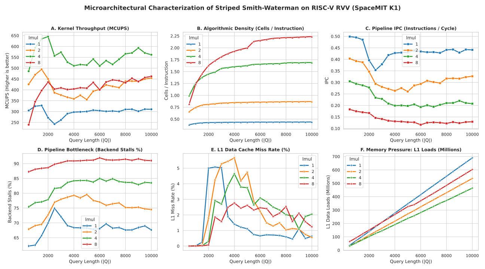

# Sequence Alignment Using the Vectorised Smith-Waterman Algorithm

[](https://github.com/AlexanderGSC/striped-sw/actions)


>An optimized C++23 implementation of the Striped Smith-Waterman algorithm proposed by Michael Farrar, transitioning from a basic reference to hardware-accelerated SIMD (SSE/AVX) and RISC-V(RVV).


## Problem Description

The **Smith-Waterman algorithm** is the gold standard for local sequence alignment in bioinformatics. However, its classic dynamic programming formulation has a quadratic time complexity of $O(m \times n)$, where $m$ and $n$ are the lengths of the query and database sequences. 

The recurrence relation dictates that each cell in the scoring matrix $H$ depends on its top, left, and diagonal neighbors:

$$H_{i,j} = \max \begin{cases} 0 \\ H_{i-1,j-1} + S(Q_i, D_j) \\ E_{i,j} \quad \text{(horizontal gap)} \\ F_{i,j} \quad \text{(vertical gap)} \end{cases}$$

Because of these tight data dependencies ($H_{i,j}$ depends on $H_{i-1,j}$ and $H_{i,j-1}$), parallelizing this algorithm using SIMD (Single Instruction, Multiple Data) vectors is highly challenging. 

### The Striped Approach
To bypass these dependency bottlenecks, **Michael Farrar (2007)** proposed the **Striped Smith-Waterman** method. Instead of processing the matrix parallel to the query or diagonally, the query sequence is divided into parallel segments (stripes) equal to the SIMD vector width. 

This approach:
* Increases instruction-level parallelism.
* Minimizes expensive vector-shift operations.
* Introduces a **Lazy F-loop** to handle and propagate delayed vertical gap corrections ($F_{i,j}$) across SIMD boundary segments.

---

## Project Status & Architecture

This repository is structured to show a clean evolutionary path from absolute logical correctness to bare-metal hardware optimization:

1. **`Golden Reference Smith Waterman`:** A C++20/23 implementation of classic Smith-Waterman, used as a validation reference in unit tests.

 2. **`RISC-V RVV Acceleration`:**
Translation of the Strip-Smith-Waterman algorithm’s logic to the RISC-V SIMD model using vector extensions. Vector intrinsics for different LMULs are derived through template specialization at compile time. This template specialization is found in the file ```rvv-traits.hpp```. Performance measurements will be conducted on the ***Banana BPI F3*** SBC, which  features eight ***SpaceMIT K1*** cores with a 256-bit VLEN. 

3. **`SIMD Acceleration` (Work in Progress):**
   The next phase involves mapping the validated emulated logic directly to hardware vector intrinsics (SSE4.1, AVX2, and AVX-512) to achieve massive performance speedups.

---
## Performance Analysis: Query Scaling (Fixed Database = 1,00,000 bp)

Evaluated natively on real silicon (**Banana Pi BPI-F3**, SpaceMit K1 octacore, RISC-V RVV 1.0 at `LMUL = 1`) comparing the scalar baseline against the vectorized Farrar Striped implementation:

| Query Size | Total Cells | Scalar Time (MCUPS) | MCUPS LMUL=1 (Speedup) | MCUPS LMUL=2 (Speedup) | MCUPS LMUL=4 (Speedup) | MCUPS LMUL=8 (Speedup) |
| :--- | :--- | :--- | :--- | :--- | :--- | :--- |
| **$1000$**    | **$10^8$**    |  **$1.54 \text{ s}$ ($64.71$)**   | **$326.32$ ($5.04$)** | **$472.06$ ($7.35$)**| **$589.31$ ($8.46$)**| **$343.6$ ($4.92$)**    |
| **$2000$**    | **$2 \times 10^8$**    |  **$3.10 \text{ s}$ ($64.57$)**   | **$272.49$ ($4.22$)** | **$453.74$ ($7.08$)**| **$643.61$ ($9.20$)**| **$423.18$ ($6.04$)** |
| **$5000$**    | **$5 \times 10^8$**    |  **$7.73 \text{ s}$ ($64.69$)**   | **$304.51$ ($4.70$)** | **$380.39$ ($5.93$)**| **$527.32$ ($7.55$)**| **$488.39$ ($5.84$)** |
| **$10000$**    | **$10^9$**    |  **$15.49 \text{ s}$ ($64.54$)**   | **$309.49$ ($4.79$)** | **$430.27$ ($6.70$)**| **$557.81$ ($7.98$)**| **$462.07$ ($6.62$)** |


> 💡 **Key Takeaways:**
> * **Scalar Baseline Consistency:** The classic scalar implementation exhibits near-constant execution throughput ($\approx 64.5 \text{ MCUPS}$), confirming a stable hardware testbench and clock frequency.
> * **Optimal Working Set ($Q = 2000$):** Peak efficiency reaches $643.61$ MCUPS ($9.20\times$ speedup) for LMUL=4. At this query length, vector striping aligns perfectly with the L1 Data Cache capacity and register file layout.
> * **L1 Cache Eviction for ($Q > 2000$):** As the size of the query profile exceeds the capacity of the L1 cache, the phenomenon of cache eviction becomes more evident.


## Performance Analysis: Problem Size Scaling ($M = N$ Square Matrix)

Evaluated natively on **SpaceMit K1** RVV 1.0 at `LMUL = 4` evaluating the asymptotic algorithmic scaling ($O(N^2)$) from small sequences up to $50,000 \times 50,000$ alignment matrices:

## 📊 Performance Benchmark: Classic SW vs. SSW RVV (`LMUL=4`)

Execution comparison on **SpaceMIT K1 (RISC-V Vector 1.0)** measuring CPU execution time, throughput (MCUPS), and vector speedup across various sequence matrix dimensions.

| Query Size | Profile | Total Cells | Classic SW Time | Classic SW (MCUPS) | SSW RVV Time | SSW RVV (MCUPS) | Speedup |
| :---: | :---: | :---: | :---: | :---: | :---: | :---: | :---: |
| **$100$** | **$100$** | $10^4$ | $0.153\text{ ms}$ | 65.22 | **$0.129\text{ ms}$** | **77.62** | **1.19×** |
| **$200$** | **$200$** | $4 \times 10^4$ | $0.625\text{ ms}$ | 64.02 | **$0.379\text{ ms}$** | **105.49** | **1.65×** |
| **$500$** | **$500$** | $2.5 \times 10^5$ | $3.650\text{ ms}$ | 68.49 | **$0.697\text{ ms}$** | **358.63** | **5.24×** |
| **$1000$** | **$1000$** | $10^6$ | $14.736\text{ ms}$ | 67.86 | **$2.214\text{ ms}$** | **451.78** | **6.66×** |
| **$2000$** | **$2000$** | $4 \times 10^6$ | $58.539\text{ ms}$ | 68.33 | **$7.607\text{ ms}$** | **525.83** | **7.70×** |
| **$5000$** | **$5000$** | $2.5 \times 10^7$ | $369.940\text{ ms}$ | 67.58 | **$51.570\text{ ms}$** | **484.78** | **7.17×** |
| **$10000$** | **$10000$** | $10^8$ | $1.460\text{ s}$ | 68.50 | **$175.603\text{ ms}$** | **569.47** | **8.31×** |
| **$20000$** | **$20000$** | $4 \times 10^8$ | $5.823\text{ s}$ | 68.70 | **$673.849\text{ ms}$** | **593.61** | **8.64×** |
| **$50000$** | **$50000$** | $2.5 \times 10^9$ | $36.357\text{ s}$ | 68.76 | **$5.521\text{ s}$** | **452.84** | **6.59×** |

> **Peak Acceleration:** Achieved **8.64× Speedup** (593.61 MCUPS) on $20\,000 \times 20\,000$ alignment matrices.

>  **Architectural Summary:**
>* **Scalar Baseline Stability:** Classic SW exhibits flat performance at $\sim 68.5\text{ MCUPS}$ regardless of input length due to execution pipeline latency bound loops.
>* **Vector Vectorization Gain:** RVV Striped SW rapidly scales throughput beyond $500\text{ MCUPS}$ once vector register saturation improves instruction density ($|Q| \ge 2\,000$).
>* **Memory Hierarchy Impact:** At extreme lengths ($50\,000\times 50\,000$, $2.5\times 10^9$ cells), throughput lowers to $452.84\text{ MCUPS}$ due to memory subsystem limits and L2 cache capacity pressure.

---

### 4.2. Vector Length Multiplier (LMUL) Trade-off Analysis

Experimental profiling on the SpaceMIT K1 processor reveals a strict structural trade-off between instruction efficiency and vector register availability across varying query lengths ($|Q| \in [1000, 10000]$):



1. **Optimal Operating Point (LMUL = 4):**
   - **Throughput:** Reaches a peak throughput of **630.74 MCUPS** ($|Q|=2000$) and maintains an average throughput of **558.2 MCUPS**, representing a **1.81× speedup** over the `LMUL=1` baseline.
   - **Instruction Density:** Evaluates up to **1.69 cells per instruction issued** (`cells_per_inst`), reducing total dynamic instruction count by up to 74% compared to `LMUL=1`.

2. **Register Spilling & Collapse at LMUL = 8:**
   - **Register Pressure:** Aggregating vector registers into groups of 8 reduces the architectural register file to only 4 logical vector registers.
   - **Cache Load Surge:** For $|Q|=10,000$, memory read requests (L1 Data Loads) drop from **690.1M** (`LMUL=1`) down to **464.3M** (`LMUL=4`). However, under `LMUL=8`, register spilling forces stack spills, causing L1 Data Loads to surge by **+29.7%** up to **602.1M**.
   - **Execution Pipeline Saturation:** Pipeline stall analysis confirms that `LMUL=8` induces severe execution latency stalls, elevating **Backend Stalls to >91.4%** and degrading the hardware IPC down to **0.124**.

---

### Getting Started

To compile and run the current emulated golden reference:

```bash
# Compile using C++23
cmake -B build   -DCMAKE_C_COMPILER=riscv64-linux-gnu-gcc   -DCMAKE_CXX_COMPILER=riscv64-linux-gnu-g++   -DCMAKE_BUILD_TYPE=Release

cmake --build build

# Run the alignment tests
build/unit_test1
build/unit_test2
```
An example of alignment

```text
ALIGNMENT
A G C - T G A C - A T C G A T A C G A G C T G G C T A - G A C A T T C A C G A T A C G 
| | |   | |   |   |     |   | | |   |       | | | | |   |     | | |   | |   |   |   | 
A G C T T G - C G A - - G - T A C - A - - - G G C T A - G - - A T T - A C - A - A - G 
```

### References
* **Farrar's Striped Algorithm:** Farrar, M. (2007). *Striped Smith–Waterman database searching instruments*. Bioinformatics, 23(2), 156-161. [DOI: 10.1093/bioinformatics/btl582](https://doi.org/10.1093/bioinformatics/btl582)
* **Original Smith-Waterman:** Smith, T. F., & Waterman, M. S. (1981). *Identification of common molecular subsequences*. Journal of Molecular Biology, 147(1), 195-197. [DOI: 10.1016/0022-2836(81)90087-5](https://doi.org/10.1016/0022-2836(81)90087-5)
